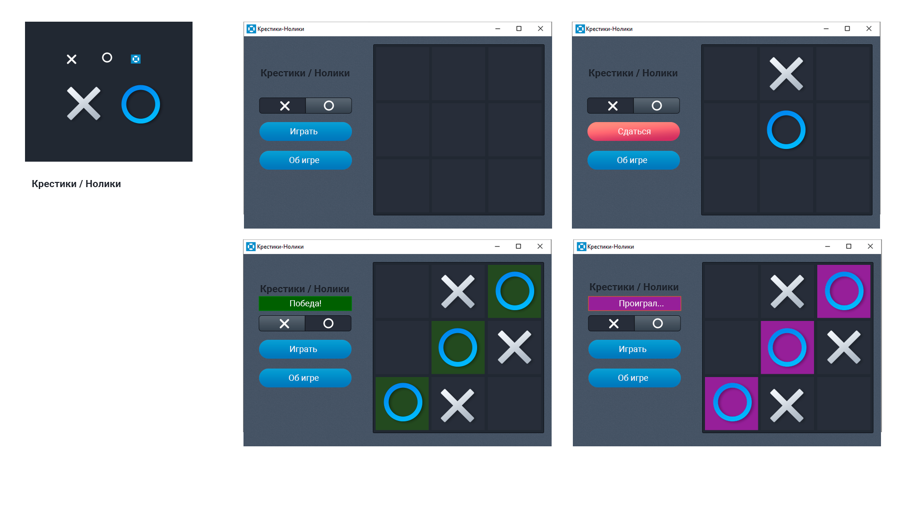

# Крестики-нолики

Проект "Крестики-нолики" представляет собой классическую игру, в которой вы можете играть против компьютера. Игра разработана с использованием QtCreator для создания десктопного приложения.

## Функционал

- Классическая игра крестики-нолики.
- Игра против компьютера с базовым искусственным интеллектом.
- Интуитивно понятный графический интерфейс с использованием Qt.

## Требования

- Qt 5 или выше (только для разработки и сборки)
- Windows (для запуска .exe файла)

## Установка и запуск

### Вариант 1: Запуск через QtCreator

1. Клонируйте репозиторий:
        git clone https://github.com/HalZiga/tictactoy
    
2. Откройте проект в QtCreator:
    - Запустите QtCreator.
    - Выберите File -> Open File or Project....
    - Найдите и откройте файл проекта .pro из клонированного репозитория.
3. Соберите и запустите проект:
    - Нажмите кнопку Run (зелёная стрелка) в QtCreator.

### Вариант 2: Запуск через .exe файл

1. Скачайте папку(https://github.com/HalZiga/tictactoy/tree/main/build).
2. Запустите tictactoe.exe

## Как играть

1. Запустите приложение.
2. Выберите клетку, куда хотите поставить свой символ (крестик).
3. Компьютер сделает свой ход.
4. Продолжайте игру до победы одной из сторон или ничьи.

## Скриншоты

Надеемся, вам понравится игра! Если у вас есть какие-либо вопросы или предложения, пожалуйста, создайте issue в репозитории или свяжитесь с нами напрямую.